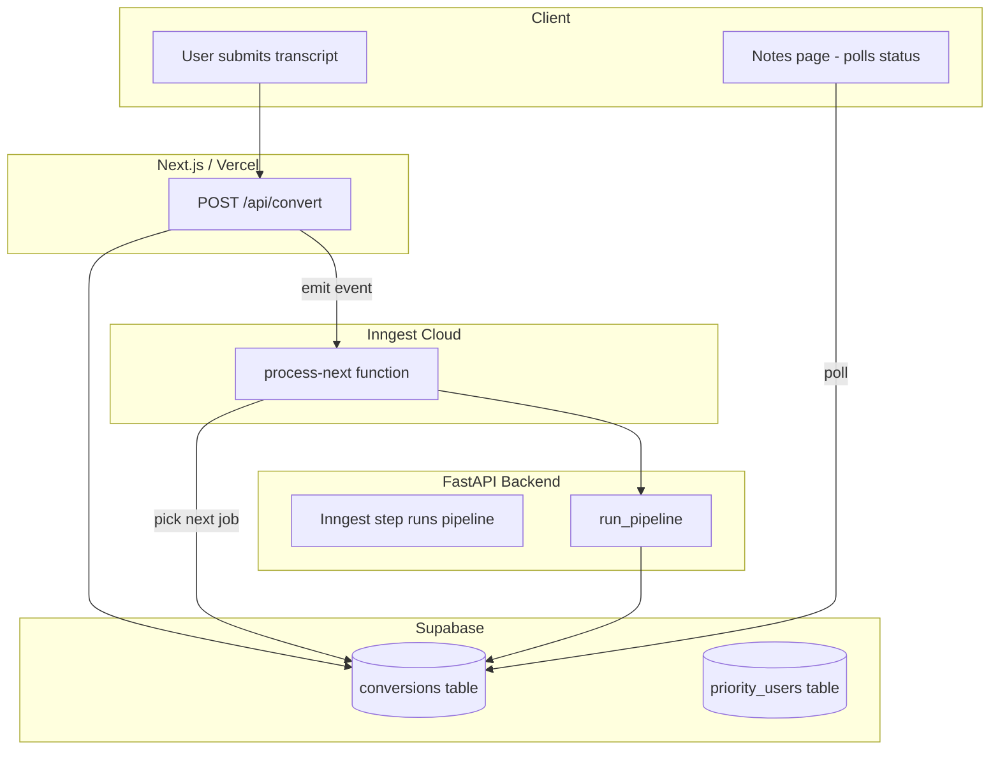

# Priority Queue Design: Supabase + Inngest

## Architecture Overview



---

## 0. Rate Limiting (LLM Calls)

**You do not use LiteLLM.** The codebase uses `google-genai` (Gemini) directly with OpenAI fallback on 503. Rate limiting is already handled by:

- **Inngest concurrency 1** — only one pipeline runs at a time, so only one job makes LLM calls at once
- **Within each pipeline:** `MAX_CONCURRENT_REQUESTS = 5` in stage2, stage3, and topic_extraction caps parallel LLM calls per job (respects Gemini/OpenAI RPM limits)

No changes needed for rate limiting.

---

## 1. Database Schema Changes

### New table: `priority_users`

```sql
create table public.priority_users (
  user_id uuid primary key references auth.users(id) on delete cascade,
  created_at timestamptz default now()
);
```

Used to determine if a job gets `is_priority = true` at creation time (denormalized for fast queue ordering).

### Changes to `conversions`

Add columns via migration:

- `is_priority` (boolean, default false) — set at insert based on whether `user_id` is in `priority_users`
- `queue_position` — **not stored**; computed at read time (see section 2)

**No `claimed_at`:** We rely on Inngest concurrency 1 to prevent double-processing. Simpler schema, no stale-claim recovery needed.

### Indexes for queue selection

```sql
create index conversions_pending_queue_order
  on conversions (is_priority desc, created_at asc)
  where status = 'pending';
```

---

## 2. Queue Ordering Logic

**Pick next job (worker):**

```sql
SELECT id, transcript, user_id
FROM conversions
WHERE status = 'pending'
ORDER BY is_priority DESC, created_at ASC
LIMIT 1;
```

- Priority users first, then FIFO by `created_at` within each tier
- Concurrency 1 ensures only one job runs at a time; no DB claiming needed

**Jobs-before-me (position):**

```sql
WITH ordered AS (
  SELECT id, ROW_NUMBER() OVER (
    ORDER BY is_priority DESC, created_at ASC
  ) AS rn
  FROM conversions
  WHERE status = 'pending'
)
SELECT (rn - 1)::int AS jobs_before FROM ordered WHERE id = $1;
```

Expose via `GET /api/conversions/:id/queue-position` (or include in conversion fetch).

---

## 3. One Job Per User

At convert (and rerun) time, before inserting:

```sql
SELECT 1 FROM conversions
WHERE user_id = $1 AND status = 'pending' LIMIT 1;
```

If row exists: return **409 Conflict** with `detail: "You already have a conversion in progress. Wait for it to finish or close the tab."`

Apply in both [api.py](api.py) `_convert_impl` and `rerun`, and mirror in the Next.js proxy if we add validation there.

---

## 4. Inngest Integration

### Where Inngest runs

Add Inngest to the **FastAPI backend** using [inngest-py](https://github.com/inngest/inngest-py) and the [FastAPI serve adapter](https://www.inngest.com/docs/sdk/serve#framework-fastapi). The pipeline already runs there, so we avoid an extra HTTP hop.

### Event flow

1. **On new job:** After inserting a pending conversion, send Inngest event `conversion/process-next`.
2. **Inngest function:**

- Concurrency: **1** (only one pipeline at a time; no DB claiming needed)
- Step 1: Query Supabase for next job (ORDER BY above)
- Step 2: **Idempotency check** — re-fetch job; if `status` is already `completed` or `failed`, skip (avoids double run when update succeeded but process died)
- Step 3: Run `run_pipeline()` (or call into the existing `_run_pipeline_and_update`)
- Step 4: If more pending jobs exist, send another `conversion/process-next` event (tail-recursion)

**Retries:** Inngest retries failed steps. On retry we may re-select the same job (e.g. if Render crashed mid-pipeline). The idempotency check reduces double execution when the update succeeded; mid-pipeline crashes may still cause one extra run (acceptable tradeoff for simpler design).

### Triggering on new job

Backend emits the event after a successful insert. **Fallback:** On backend startup, check for pending jobs; if any exist, emit (covers crash recovery and cold start). No health-ping emit—rely on startup + new-job + Inngest tail-recursion only.

---

## 5. API Surface Summary

| Endpoint                              | Purpose                                                       |
| ------------------------------------- | ------------------------------------------------------------- |
| `POST /api/convert`                   | Create job; enforce one-per-user; enqueue; emit Inngest event |
| `POST /api/convert/rerun`             | Same as convert, for failed jobs                              |
| `GET /api/conversions/:id`            | Include `queue_position` (jobs before) when status is pending |
| `GET /api/conversions/:id/queue-position` | Returns `{ jobs_before: number }` for pending jobs (for UI) |
| `GET /health`                         | Wake server (no DB check, no emit)                                  |
| Inngest function (internal)           | Picks next job, runs pipeline, emits event if more pending    |

---

## 6. Priority User Management

- **Adding priority:** Insert into `priority_users` (admin action, or future "upgrade" flow).
- **Removing:** Delete from `priority_users`.
- No RLS needed if only the service role modifies this table; the backend checks membership when creating a conversion.

---

## 7. Edge Cases

- **Inngest retry after partial success:** If the pipeline completes but the Supabase update fails, a retry would re-run the pipeline. The idempotency check (re-fetch status before running) prevents double execution when the update actually succeeded.
- **Render crash mid-pipeline:** Inngest retries; we may run the same job twice. Acceptable tradeoff for simpler design (no `claimed_at`, no stale-claim recovery).

---

## 8. File Change Summary

- **New migrations:** `priority_users` table; `conversions` column `is_priority` (no `claimed_at`)
- **[api.py](api.py):** Remove in-memory queue; add one-per-user check; Inngest client + function; emit event on new job; idempotency check before pipeline; emit process-next on startup when pending jobs exist; endpoint to return `queue_position` for pending jobs
- **[app/(app)/notes/[id]/page.tsx](app/(app)/notes/[id]/page.tsx):** When pending, fetch `queue_position` (via `/api/conversions/:id/queue-position` or included in conversion) and display: *"There are N jobs ahead of you in queue right now, please do not close this tab"* (when N=0: *"You're next in queue, please do not close this tab"*) (when N=0: *"You're next in queue, please do not close this tab"*) (when N=0, use *"You're next in queue, please do not close this tab"*) (when N > 0); when N = 0, use *"You're next in queue, please do not close this tab"* (when N=0: *"You're next in queue, please do not close this tab"*) (when N=0: *"You're next in queue, please do not close this tab"*)
- **Inngest:** Mount Inngest in FastAPI (inngest-py); expose serve endpoint for Inngest Cloud to call
- **Optional:** Admin or API to manage `priority_users`
